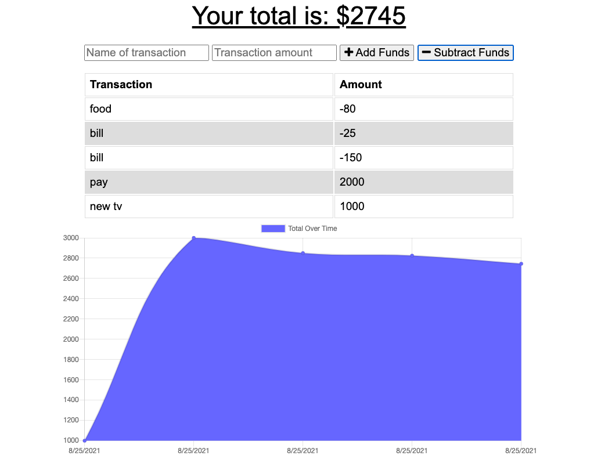

# Unit 18 PWA Homework: Online/Offline Budget Trackers

## Table of Contents

1. [Description](#Description)
2. [Criteria](#Criteria)
3. [Installation](#Installation)
4. [Usage](#Usage)
5. [Contributing](#Contributing)
6. [Issues](#Issues)
7. [Credits](#Credits)
8. [License](#License)
9. [Questions](#Questions)

## Description

All we needed to do for this application was make the transactions that occur while offline persist to when the user comes back online. This uses a temporary store in the database to hold the information while the user is offline, then Posts the data to the database once it comes back online.

[Deployed website](https://budget-tracker-thing.herokuapp.com/)

Example picture:

## Criteria

GIVEN a user is on Budget App without an internet connection

WHEN the user inputs a withdrawal or deposit

THEN that will be shown on the page, and added to their transaction history when their connection is back online.

## Installation

Files must be downloaded from Github. Then, run npm install to get the necessary node modules. Start mongod in a separate window. Please note the database does not have seed information. Last, run npm start.

A ready version is also available at the [deployed website](https://budget-tracker-thing.herokuapp.com/)

## Usage

This is an application where users can track their deposits and expenses and keep track of their total. The transactions and tracking can be made even while offline and will update once the application comes back online.

## Contributing

For contributions, please create a fork to work on then, when done, create a Pull Request.

## Issues

Submit an Issue through Github for any bugs or problems.

## Credits

Assignment was developed as part of the SMU Coding Bootcamp.

## License

This is covered under the <a href='https://opensource.org/licenses/ISC'>ISC</a> license.

## Questions

Feel free to contact through the following with any questions:

Email: katherine@katherinehopkins.me

Github: <a href='https://github.com/khopkins206'>khopkins206</a>
